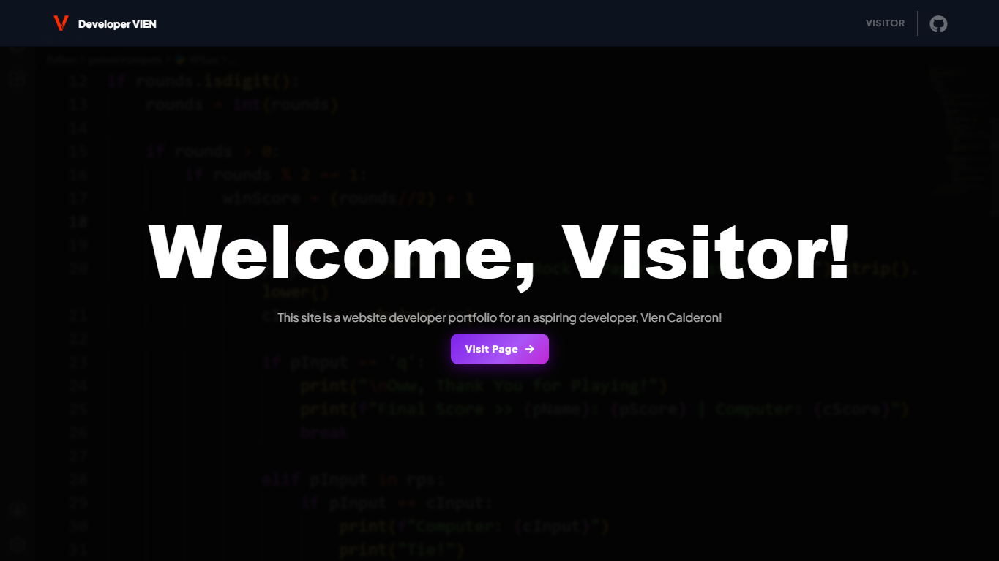

# 🧑‍💻 Developer VIEN — Portfolio
### 🔰 Phase 3 — Dashboard Sections (In Progress)


A personal developer portfolio for **Vien Fritzgerald V. Calderon**, built entirely with vanilla HTML, CSS, and JavaScript — no frameworks, no backend. Features a dark glassmorphism aesthetic, dual-mode welcome page (Visitor & Developer), and a fully editable admin dashboard.

---

## 🎯 Overview

This portfolio is designed to present Vien's developer life, projects, and background in a clean, interactive format. Visitors can browse the portfolio in read-only mode, while the developer (Vien) can log in through a restricted login form to gain admin access — enabling live edits to content directly on the dashboard.

### 👨‍💻 Developer
**Developer VIEN (Vien Fritzgerald V. Calderon)**

---

## ✨ Key Features

### 🏠 Welcome Page
- Dual-mode landing page — **Visitor Mode** (default) and **Developer Mode** (toggle via double-clicking the logo)
- Visitor Mode: click "Visit Page" to enter the dashboard in read-only mode
- Developer Mode: restricted login form with email/password fields, Google and Microsoft OAuth buttons, SHOW/HIDE password toggle, and animated error/success feedback

### 📊 Dashboard
- **Home**: Hero section with profile photo, nickname, and developer summary
- **WHO AM I?**: Age (live-calculated, updates every second), educational background, skills, and additional info
- **TIMESTAMPS**: Developer life milestones rendered from a JS data array, sorted by year
- **Projects**: All projects sorted yearly, each with a Live link and GitHub source button
- **Certificates**: Structure in place — rendering not yet implemented
- **SEND ME YOUR DM**: Contact form (name, email, subject, message) — EmailJS integration pending

### 🔐 Authentication
- Google Sign-In via Firebase Authentication (OAuth — no backend needed)
- Developer UID whitelist — only Vien's account grants admin access
- Admin redirect to dashboard with `?mode=admin` query param
- Session stored in `sessionStorage`

### ✏️ Admin Edit Mode *(Phase 4 — Planned)*
- Edit button revealed on WHO AM I?, TIMESTAMPS, and Projects sections when logged in as admin
- WHO AM I?: `contenteditable` inline editing
- TIMESTAMPS: add and remove entries with date, title, and description
- Projects: add and remove project cards (name, description, tech tags, live URL, GitHub URL)
- All changes persisted via `localStorage`

---

## 🛠️ Technology Stack

- **Frontend**: HTML5, CSS3, JavaScript (ES6+)
- **Styling**: Custom CSS — glassmorphism (body-level backdrop-filter), CSS Grid, CSS Variables
- **Auth**: Firebase Authentication (Google OAuth)
- **Contact**: EmailJS (free tier, no backend)
- **PDF Preview**: PDF.js (v3.11.174) — canvas-based first-page thumbnail rendering
- **Persistence**: localStorage (admin edits, profile card state)
- **Font**: Plus Jakarta Sans
- **Icons**: Font Awesome 6

🔗 ***Links***:
- **Firebase Console**: [console.firebase.google.com](https://console.firebase.google.com)
- **EmailJS**: [emailjs.com](https://www.emailjs.com)
- **Font**: [Plus Jakarta Sans — Google Fonts](https://fonts.google.com/specimen/Plus+Jakarta+Sans)
- **Icons**: [Font Awesome](https://fontawesome.com)
- **Grid Tool**: [CSS Grid Generator](https://cssgrid-generator.netlify.app/)
- **Glass Reference**: [Glassmorphism Generator](https://hype4.academy/tools/glassmorphism-generator)

---

## 📁 Project Structure

```
my-portfolio/
│
├── 📂 assets/
│   ├── 📂 css/
│   │   ├── style.css           # Welcome page styles (index.html)
│   │   └── dashboard.css       # Dashboard styles (pages/dashboard.html)
│   │
│   ├── 📂 js/
│   │   ├── main.js             # Welcome page logic, mode toggle, login form
│   │   └── dashboard.js        # Dashboard rendering, navigation, admin edit mode
│   │
│   └── 📂 images/
│       ├── logo.png            # Red V logo (favicon + header)
│       ├── background.png      # Python code background
│       ├── picture.jpeg        # Developer profile picture
│       ├── google.png          # Google OAuth icon
│       ├── banner.png          # README.md preview
│       └── microsoft.png       # Microsoft OAuth icon
│
├── 📂 data/
│   └── 📂 files/
│       ├── list.json           # CV/Resume metadata (filename, label, etc.)
│       └── resume.pdf          # Sample resume for the website
│
├── 📂 pages/
│   └── dashboard.html          # Main portfolio dashboard
│
├── index.html                  # Welcome & login page (entry point)
└── README.md                   # Project documentation
```

---

## 🚀 Getting Started

### Prerequisites
- Modern web browser (Chrome, Firefox, Edge, Safari)
- Firebase project with Google Authentication enabled
- EmailJS account with a configured service and template

### Running Locally
1. Clone the repository: `git clone https://github.com/devssst/my-portfolio`
2. Open `index.html` directly in a browser (no local server required)
3. Double-click the logo to switch to Developer Mode
4. Enter authorized credentials to access the admin dashboard

### Firebase Setup (for auth)
1. Go to [Firebase Console](https://console.firebase.google.com) and create a project
2. Enable **Google Sign-In** under Authentication → Sign-in method
3. Add your Firebase config to `main.js`
4. Whitelist only your Google UID under authorized users

---

## 🎨 Design Language

### Color Palette
- **Background**: Lavender anime art (`background.png`)
- **Overlay**: Single `body::before` with `rgba(0, 0, 0, 0.75)` + `backdrop-filter: blur(6px)` applied once globally
- **Header**: `rgba(17, 25, 40, 0.75)` with its own `backdrop-filter: blur(8px) saturate(180%)`
- **Cards**: `rgba(255, 255, 255, 0.001–0.01)` — extremely subtle white tint, defined by borders
- **Accent Purple**: `#a855f7` / `#7c22e8` / `#c026d3`
- **Logo**: Red `#FF2200` V on black
- **Text Primary**: `#ffffff`
- **Text Muted**: `rgba(255, 255, 255, 0.35–0.65)`

> **Note:** Per-card `backdrop-filter` is currently disabled (commented out) due to performance issues. Glassmorphism is achieved via the single global `body::before` blur instead.

### UI Highlights
- CSS Grid 16-column × 12-row layout
- Section-based navigation: 6 sections (`home`, `about`, `timeline`, `projects`, `certificates`, `reach`)
- Keyboard navigation (↑↓ arrow keys) and wheel hijacking between sections
- Profile card smooth slide-out animation with synchronized content shift
- Purple scrollbar that auto-appears on scroll, fades after 1.5s of inactivity
- Purple gradient buttons with hover lift and glow
- Shake animation on login errors
- Green/red button state transitions on success/failure

---

## 🚧 Roadmap

### Phase 1 — Welcome Page & Auth
- [x] Visitor Mode welcome screen with Visit Page button
- [x] Double-click logo toggle between Visitor and Developer modes
- [x] Developer login form UI (email, password, SHOW/HIDE toggle)
- [x] Google and Microsoft OAuth button layout
- [x] Form validation with animated error states (shake + red inputs)
- [x] Login success state (green button → redirect to dashboard)
- [x] Back to Visitor Mode button
- [ ] Firebase project setup and Google Sign-In integration
- [ ] Developer UID whitelist in Firebase
- [x] Redirect to `pages/dashboard.html?mode=admin` on successful login
- [ ] Store auth state in `sessionStorage`

### Phase 2 — Dashboard Shell
- [x] Sticky header matching `index.html` style — show "ADMIN" badge if `?mode=admin`
- [x] HTML skeleton with 6 section anchors: `home`, `about`, `timeline`, `projects`, `certificates`, `reach`
- [x] Section navigation via header nav links, ↑↓ arrow keys, and mouse wheel hijacking
- [x] Full-page scrolling layout, dark overlay, consistent padding
- [x] Read `?mode=admin` param in `dashboard.js` and set global `isAdmin` flag

### Phase 3 — Dashboard Sections
- [x] **Home** — profile photo, nickname, tagline, GitHub link
- [x] **WHO AM I?** — live age counter (updates every second), education card, skills tags; profile card collapse animation; data from JS array
- [x] **TIMESTAMPS** — year-grouped timeline rendered from `TIMELINE_DATA` JS array; `.timeline-item` cards with title, date, description
- [x] **Projects** — year-grouped card grid rendered from `PROJECTS_DATA` JS array; tech tag pills, Live demo + GitHub source buttons, hover lift & glow
- [x] **CV / Resume** — document cards with PDF.js first-page canvas thumbnail, click to expand, download button; metadata from `data/files/list.json`
- [ ] **Certificates** — HTML structure exists, rendering function not yet implemented
- [ ] **SEND ME YOUR DM** — HTML structure exists, EmailJS integration pending

### Phase 4 — Admin Edit Mode
- [ ] Show edit pencil buttons on WHO AM I?, TIMESTAMPS, and Projects when `isAdmin` is true
- [ ] WHO AM I?: `contenteditable` inline editing; Save writes to `localStorage`
- [ ] TIMESTAMPS: inline "Add entry" form (date, title, description) + delete icon per entry
- [ ] Projects: "Add project" modal (name, desc, tech, live URL, GitHub URL) + remove button per card
- [ ] On page load, check `localStorage` first — override default JS arrays if data exists

### Phase 5 — Polish & Deploy
- [ ] Mobile responsiveness — test at 375px, fix header, hero, timeline, project grid
- [ ] Scroll-triggered entrance animations via `IntersectionObserver`
- [ ] Deploy to GitHub Pages (repo: `devssst/my-portfolio`)
- [ ] Update Firebase authorized domains to include GitHub Pages URL

---

## 📋 Update Logs

### Phase 3 — Dashboard Sections (In Progress, May 2026)
**Completed:**
- Section navigation system with 6 sections; supports header nav clicks, ↑↓ arrow keys, and wheel hijacking with 300ms cooldown
- TIMESTAMPS rendered dynamically from `TIMELINE_DATA` array; grouped by year
- Projects rendered dynamically from `PROJECTS_DATA` array; tech tag pills, live + source buttons
- CV/Resume document cards with PDF.js canvas thumbnails (first page, scaled to 220px width); click to expand, download button; loads from `data/files/list.json` → localStorage → fallback array
- Profile card collapse: smooth `translateX` slide-out + synchronized negative `margin-right`; state persisted to `localStorage`
- Live age counter (`calcAge()`) updating every second in the WHO AM I? section
- Purple scrollbar auto-show on scroll, auto-hide after 1.5s via per-element timeout map
- Mode badge (ADMIN / VISITOR) driven by `?mode=admin` query parameter

**Design decisions:**
- Glassmorphism moved from per-card `backdrop-filter` to a single `body::before` overlay for performance
- Card backgrounds set to `rgba(255, 255, 255, 0.001–0.01)` — near-invisible tint, borders provide definition
- Section names finalized: **WHO AM I?**, **TIMESTAMPS**, **SEND ME YOUR DM** (vs. original About Me / Timeline / Reach Me)
- Header scroll-hide disabled — header stays fixed at all times (`hideHeader` / `showHeader` functions exist but listener is commented out)

**Cleanup needed:**
- Empty `<p class="hero-bio">` tag and unused `.hero-bio`, `.hero-bio-wai`, `.hero-bio-q` CSS classes
- `.dash-header.hidden` CSS class defined but unused (kept for potential future use)

---

### Phase 2 — Dashboard Shell (Completed, May 2026)
**Completed:**
- Dashboard HTML skeleton (`pages/dashboard.html`) with all 6 section anchors
- Sticky header with ADMIN/VISITOR badge
- `dashboard.js`: `isAdmin` flag, `switchSection()`, `loadFromStorage()` localStorage wrapper
- `section-fade-in` CSS animation on section switch (0.3s)

---

### Phase 1 — Welcome Page & Auth (Completed, May 2026)
**Completed:**
- Dual-mode welcome page (Visitor / Developer toggle via logo double-click)
- Login card UI with glassmorphism styling — email, password, SHOW/HIDE toggle
- Google and Microsoft social login button layout
- Form validation: empty field check, email format check, hardcoded credential check
- Animated feedback: shake on invalid input, red/green button states, success redirect
- Back to Visitor Mode button wired to mode toggle
- Hardcoded credentials as placeholder (to be replaced with Firebase Auth)

**Technical:**
- `main.js`: mode toggle, form validation, `triggerInputError()`, `triggerBtnError()`, `triggerBtnSuccess()`
- `style.css`: `.login-card` glassmorphism, `.input-groups`, `.p-wrapper`, `.toggle-text`, `.divider`, `.social-btn`, `.btn-error`, `.btn-success`, `@keyframes shake`

---

## 📄 License

This project is proprietary software. All rights reserved by Developer VIEN.
The source code is publicly visible on GitHub for portfolio evaluation purposes only.
See [LICENSE.md](LICENSE.md) for full terms.

---

## 👨‍💻 Developer

**Developer VIEN**

- Full name: Vien Fritzgerald V. Calderon
- Course & Section: Bachelor of Science in Information Technology — 1I
- Institution: Dalubhasaang Politekniko ng Lungsod ng Baliwag
- GitHub: [devssst/my-portfolio](https://github.com/devssst/my-portfolio)
- Year: 2026

---

## 📞 Contact

- Email: viencalderon15@gmail.com
- GitHub: [github.com/devssst](https://github.com/devssst)

---

**Made with ❤️ — a personal space to grow as a developer.**

*"First, solve the problem. Then, write the code."* — John Johnson
